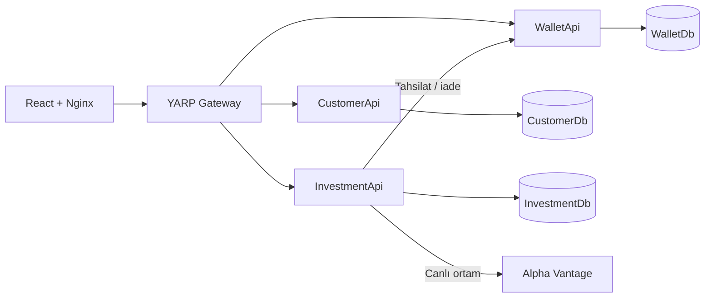

# ArcPay

ArcPay; müşteri kimliği, çoklu para birimi cüzdanları, eşzamanlı P2P transfer ve yatırım portföyü özelliklerini ayrı mikroservislerde gösteren bir finansal sistem demosudur.

## Hızlı başlangıç

Gereken tek ön koşul Docker Desktop'ın çalışıyor olmasıdır.

```bash
docker compose up --build
```

Servisler sağlıklı duruma geldiğinde uygulamayı açın:

- Web uygulaması: http://localhost:5173
- Gateway sağlık kontrolü: http://localhost:5050/health

Demo kullanıcıları aynı parolayı kullanır: `Demo123!`

| Kullanıcı | E-posta | Telefon | Müşteri numarası |
|---|---|---|---|
| Demo Gönderen | `demo.sender@arcpay.test` | `+905551000001` | `ARC-9000000001` |
| Demo Alıcı | `demo.receiver@arcpay.test` | `+905551000002` | `ARC-9000000002` |
| Demo Alternatif | `demo.alternate@arcpay.test` | `+905551000003` | `ARC-9000000003` |

Arka planda çalıştırmak için `docker compose up --build -d`, durumları görmek için `docker compose ps` kullanabilirsiniz.

## Mimari



| Bileşen | Sorumluluk | Container portu | Host portu |
|---|---|---:|---:|
| Frontend | React SPA ve API reverse proxy | 8080 | 5173 |
| Gateway | JWT doğrulama ve servis yönlendirme | 8080 | 5050 |
| CustomerApi | Kayıt, giriş ve müşteri çözümleme | 8080 | yalnızca iç ağ |
| WalletApi | Cüzdan, transfer, işlem geçmişi | 8080 | yalnızca iç ağ |
| InvestmentApi | Piyasa, portföy ve satın alma sagası | 8080 | yalnızca iç ağ |
| PostgreSQL | Servis başına bağımsız veritabanı | 5432 | 5434-5436 |

Tarayıcı yalnızca Nginx'e bağlanır. `/api/*` istekleri Nginx'ten Gateway'e, oradan ilgili mikroservise gider. API containerları host'a açılmadığı için servis sınırı korunur.

## Gösterilebilir senaryolar

### Kayıt ve giriş

Yeni kullanıcı oluşturabilir veya giriş ekranındaki demo hesaplardan birini seçebilirsiniz. JWT CustomerApi tarafından üretilir; Gateway ve korumalı servisler aynı issuer, audience ve imza anahtarıyla doğrular.

### Cüzdan ve P2P transfer

1. Demo Gönderen ile giriş yapın.
2. TRY, USD, EUR veya XAU cüzdanı açın.
3. Para yatırın.
4. Alıcıyı ArcPay numarası, e-posta veya telefonla bulun.
5. Transferi gönderip işlem geçmişini kontrol edin.

Transfer aynı PostgreSQL transaction'ında, cüzdanları artan kimlik sırasıyla `FOR UPDATE` kilitleyerek yapılır. İşlem referansı tekrar gönderilirse ikinci kez para hareketi oluşmaz.

### Yatırım sagası

1. USD cüzdanında bakiye oluşturun.
2. **Yatırımlar** sayfasından AAPL, MSFT veya TSLA alın.
3. Varlığın portföye eklendiğini kontrol edin.
4. Satın alma penceresindeki telafi seçeneğini açarak geliştirme hata senaryosunu çalıştırın.

InvestmentApi önce WalletApi'den tahsilat yapar, ardından portföyü yazar. Portföy yazımı başarısız olursa saga telafisi WalletApi'ye iade çağrısı gönderir. İade de başarısız olursa işlem `CompensationFailed` durumuna alınır ve `FailedCompensation` kaydı oluşturulur.

Development ortamı dış servis limiti olmadan tekrarlanabilir test için sabit piyasa verisi kullanır. Canlı Alpha Vantage sağlayıcısını kullanmak için `MarketData__Provider=AlphaVantage` ve `ALPHA_VANTAGE_API_KEY` yapılandırılmalıdır.

## Loglama ve correlation ID

Bütün .NET servisleri Serilog üzerinden tek satırlık JSON log üretir. Gateway gelen `X-Correlation-Id` değerini korur; başlık yoksa yeni bir değer üretir. Aynı değer:

- HTTP yanıt başlığına eklenir,
- YARP ile hedef mikroservise iletilir,
- InvestmentApi'den WalletApi'ye yapılan çağrıda taşınır,
- ProblemDetails cevaplarına ve bütün ilgili loglara yazılır.

Örnek:

```bash
curl -i -H 'X-Correlation-Id: supervisor-demo-001' http://localhost:5050/health
docker compose logs gateway | grep supervisor-demo-001
```

Bu sayede tek bir isteğin servisler arasındaki yolculuğu aynı kimlikle takip edilebilir.

## Yapılandırma

Proje varsayılan değerlerle doğrudan demo olarak çalışır. Değerleri değiştirmek isterseniz:

```bash
cp .env.example .env
```

| Değişken | Açıklama |
|---|---|
| `ARCPAY_JWT_KEY` | En az 32 bayt JWT imza anahtarı |
| `ARCPAY_DB_PASSWORD` | Üç demo PostgreSQL örneğinin parolası |
| `ALPHA_VANTAGE_API_KEY` | Canlı piyasa sağlayıcısının API anahtarı |

Compose dosyasındaki varsayılan anahtarlar yalnızca yerel geliştirme içindir; üretim ortamında secret manager kullanılmalıdır.

## Test ve kalite kontrolleri

.NET testleri gerçek PostgreSQL üzerinde Testcontainers kullanır. Docker Desktop çalışırken:

```bash
dotnet test ArcPay.sln
```

Frontend test ve üretim derlemesi:

```bash
cd arcpay-fe
npm ci
npm test
npm run build
```

Compose yapılandırmasını doğrulamak için:

```bash
docker compose config --quiet
docker compose up --build --wait
docker compose ps
```

## Durdurma ve veri yönetimi

Containerları durdurmak için:

```bash
docker compose down
```

Bu komut veritabanı volume'larını korur. Tamamen temiz bir demo verisi gerektiğinde volume'ları da silmek mümkündür; bu işlem mevcut yerel ArcPay verilerini geri döndürülemez biçimde kaldırır:

```bash
docker compose down --volumes
```

## Proje yapısı

```text
ArcPay/
├── arcpay-fe/                 React + TypeScript arayüzü
├── src/
│   ├── ArcPay.CustomerApi/    Kimlik ve müşteri servisi
│   ├── ArcPay.WalletApi/      Core domain ve para hareketleri
│   ├── ArcPay.InvestmentApi/  Portföy ve saga orkestrasyonu
│   ├── ArcPay.Gateway/        YARP giriş kapısı
│   └── ArcPay.Shared/         Ortak hata, güvenlik ve gözlemlenebilirlik
├── tests/                     Unit ve PostgreSQL integration testleri
└── docker-compose.yml         Tam sistem orkestrasyonu
```

Teknik kararların ayrıntılı gerekçeleri [tasarım dokümanında](docs/superpowers/specs/2026-07-17-arcpay-design.md) bulunmaktadır.
