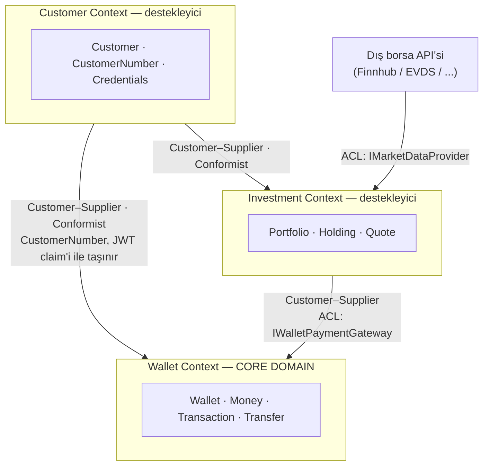
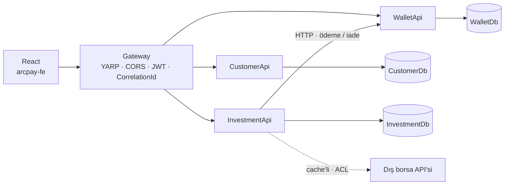
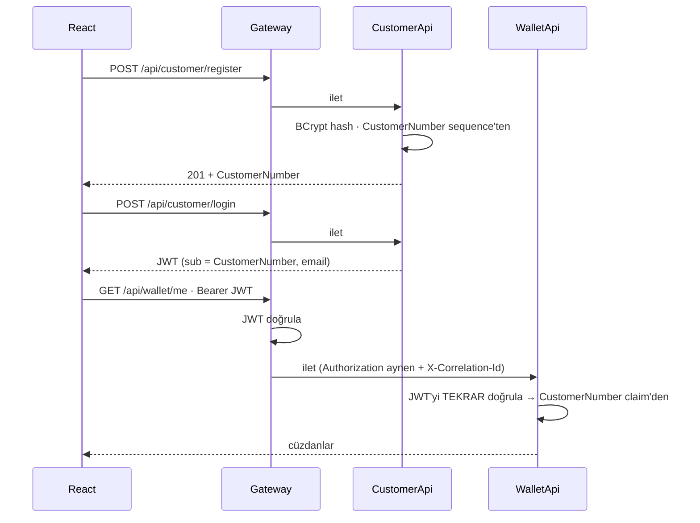
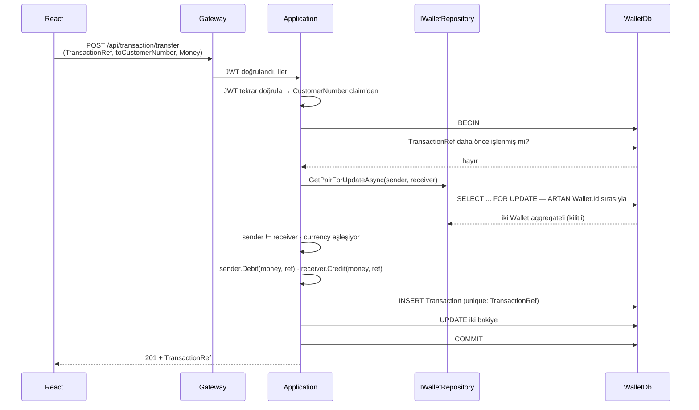
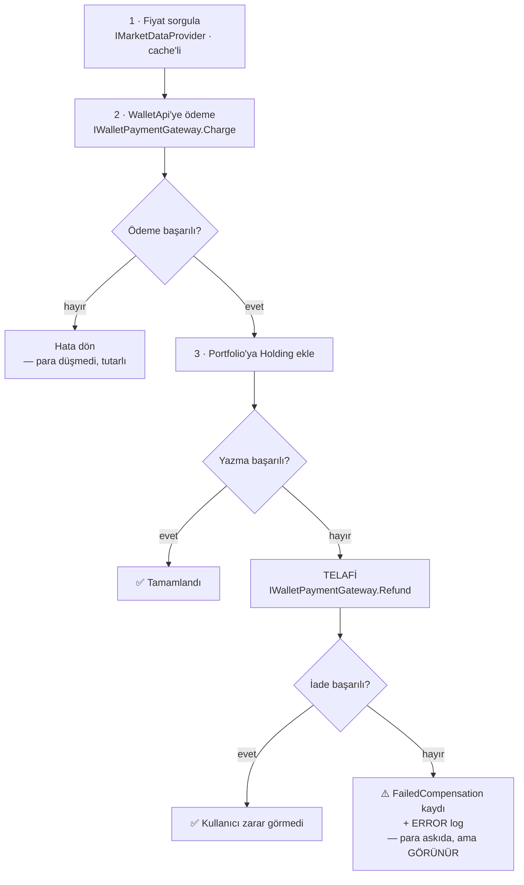

# ArcPay — Teknik Tasarım Dokümanı

**Tarih:** 2026-07-17 · **Son güncelleme:** 2026-07-19 · **Durum:** Onaylandı · **Kaynak:** `ArcPay Geliştirme Dokümanı.pdf`

> Bu doküman projenin **tek doğru kaynağıdır**. Tasarım değişirse önce burası değişir,
> kod sonra. Sunum sürümü bu dosyadan üretilir.

## İçindekiler

1. [Özet](#1-özet)
2. [Amaç ve Kapsam](#2-amaç-ve-kapsam)
3. [Stratejik Tasarım (DDD)](#3-stratejik-tasarım-ddd)
4. [Sistem Mimarisi](#4-sistem-mimarisi)
5. [Repo Yapısı ve Katmanlama](#5-repo-yapısı-ve-katmanlama)
6. [Taktiksel Tasarım — Wallet Context](#6-taktiksel-tasarım--wallet-context-core-domain)
7. [Customer Context](#7-customer-context-destekleyici-alan)
8. [Investment Context](#8-investment-context)
9. [Veri Modeli](#9-veri-modeli)
10. [Kimlik Doğrulama](#10-kimlik-doğrulama)
11. [Para Transferi — ACID](#11-para-transferi--pdf-bölüm-3-acid)
12. [Investment Orkestrasyonu](#12-investment-orkestrasyonu--pdf-bölüm-4)
13. [Dış Servis ve Cache](#13-dış-servis-entegrasyonu-ve-cache--pdf-bölüm-5)
14. [Hata Yönetimi](#14-hata-yönetimi)
15. [Test Stratejisi](#15-test-stratejisi)
16. [Yol Haritası](#16-yol-haritası)
17. [Mevcut Repoda Düzeltilecekler](#17-mevcut-repoda-düzeltilecek-hatalar-faz-0)
18. [Karar Kaydı](#18-karar-kaydı)
19. [Riskler ve Açık Konular](#19-bilinen-riskler-ve-açık-konular)

---

## 1. Özet

ArcPay, çoklu para birimli cüzdanlar, müşteriler arası para transferi ve bakiyeyle piyasa
varlığı alımı sunan bir ödeme/yatırım simülasyonudur. Dört .NET servisi (Gateway,
Customer, Wallet, Investment), servis başına bir Postgres veritabanı ve bir React arayüzü.

Tasarımın merkezindeki üç iddia:

1. **Para hareketi ACID'dir.** Gönderen ve alıcı cüzdanı aynı veritabanındadır; tek bir
   transaction, artan `Wallet.Id` sırasıyla alınan `SELECT ... FOR UPDATE` kilitleri ve
   `TransactionRef` üzerindeki unique index ile çifte harcama ve deadlock imkânsız kılınır.
   Bu, iddia olarak değil **test olarak** teslim edilir.
2. **Karmaşıklık core domain'e yığılır.** Taktiksel DDD yalnızca `WalletApi`'ye uygulanır —
   para orada. `CustomerApi` bilinçli olarak sade CRUD kalır.
3. **Investment'ta ACID yoktur ve bu gizlenmez.** İki veritabanı arası tutarlılık saga +
   telafi ile sağlanır; daha doğru olan alternatifin (rezervasyon) neden seçilmediği
   [Bölüm 12](#neden-b-rezerve-et--onayla-aslında-daha-doğru)'de gerekçesiyle kayıtlıdır.

---

## 2. Amaç ve Kapsam

**Kapsam:** PDF'in tamamı — Customer, Wallet, P2P transfer, Investment ve React arayüzü;
uçtan uca çalışan bir demo. Hedef süre ~1-2 ay.

**Kapsam dışı ve gerekçeleri:**

| Kapsam dışı | Neden |
|---|---|
| Gerçek para, gerçek KYC | Simülasyon; düzenleyici yükümlülük yok |
| Kubernetes, service mesh | Öğrenme hedefine katkısı yok, kapsamı şişirir |
| Mesaj kuyruğu (RabbitMQ/Kafka) | Saga senkron HTTP ile çözülüyor — bkz. Bölüm 12 |
| Para birimleri arası çevrim (TRY↔USD) | Transfer yalnızca aynı para birimi içinde |
| Dağıtık cache (Redis) | Tek instance çalışıyoruz; `IMemoryCache` yeterli |

---

## 3. Stratejik Tasarım (DDD)

### 3.1 Subdomain sınıflandırması

DDD'nin ilk sorusu "hangi desenleri kullanacağız" değil, **"karmaşıklık nerede?"**dir.
Taktiksel desenler core domain'e uygulanır; destekleyici alanlarda sadelik tercih edilir.
Her yere aynı ceremonyi uygulamak DDD'ye **aykırıdır**.

| Context | Sınıf | Gerekçe | Uygulanan desen |
|---|---|---|---|
| **Wallet** | **Core domain** | Projenin bütün gerçek zorluğu burada: değişmezler, eşzamanlılık, para bütünlüğü | **Tam taktiksel DDD** — aggregate, value object, repository, domain service |
| **Investment** | Destekleyici | Orkestrasyon ve dış entegrasyon ağırlıklı; domain kuralı sığ | **Kısmi** — `Portfolio` aggregate + ACL'ler |
| **Customer** | Destekleyici | İşi "kayıt ol / giriş yap". Domain kuralı neredeyse yok | **Hiç** — sade CRUD katmanları |

> **Servisler neden farklı yapıda?** Bu tutarsızlık değil, bilinçli karardır. `CustomerApi`'ye
> aggregate + repository + domain event koymak, üç satırlık CRUD'a tören elbisesi giydirmek
> olurdu: kod artar, anlam artmaz. Karmaşıklık, değer ürettiği yere konur.

### 3.2 Context Map



**İlişkilerin okunuşu:**

- **Customer → Wallet / Investment (Customer–Supplier, Conformist).** Customer yukarı akış.
  Wallet ve Investment, `CustomerNumber`'ı JWT claim'i üzerinden alır ve formatına uyar.
  Dikkat: Wallet, CustomerApi'yi **hiç çağırmaz** — bağ yalnızca identifier üzerindendir.
  Bu, en zayıf ve en sağlıklı bağ türüdür.
- **Investment → Wallet (Customer–Supplier + ACL).** Investment aşağı akış: ödeme için
  Wallet'ı çağırır. Wallet, Investment'ın varlığından habersizdir. Investment'ın domain'i
  Wallet'ın HTTP DTO'larını **görmez**; arada `IWalletPaymentGateway` anti-corruption
  layer'ı vardır.
- **Dış borsa API'si → Investment (ACL).** Finnhub'ın JSON şeması domain'e sızmaz.
  `IMarketDataProvider` arayüzü domain'de, `FinnhubAdapter` altyapıdadır. Sağlayıcı
  değişirse yalnızca adapter değişir.

### 3.3 Ubiquitous Language

Kodda, dokümanda ve konuşmada **aynı** kelimeler kullanılır. Bir kavramın iki adı olmaz.

| Terim | Anlamı | Context |
|---|---|---|
| **Customer** | Sistemi kullanan kişi | Customer |
| **CustomerNumber** | Müşterinin public iş anahtarı (`ARC-1000000001`). Transferde alıcı bununla belirtilir | Tümü |
| **Wallet** | Bir müşterinin tek bir para birimindeki bakiyesi. Aggregate root | Wallet |
| **Money** | Tutar + para birimi. Ayrılamaz bütün. Value object | Wallet, Investment |
| **Balance** | Bir cüzdanın o anki `Money` değeri. Doğrudan yazılamaz | Wallet |
| **Transaction** | Gerçekleşmiş bir para hareketinin resmi kaydı. Bakiyeyi değiştiren tek şey | Wallet |
| **Transfer** | İki cüzdan arasında para hareketi (Transaction'ın bir türü) | Wallet |
| **Deposit / Withdrawal** | Sisteme para girişi / çıkışı | Wallet |
| **TransactionRef** | Bir hareketin public referansı ve idempotency anahtarı | Wallet |
| **Portfolio** | Bir müşterinin sahip olduğu varlıkların bütünü. Aggregate root | Investment |
| **Holding** | Portföydeki tek bir varlık kalemi (`AAPL`, 3 adet) | Investment |
| **Quote** | Bir varlığın dış servisten gelen anlık fiyatı | Investment |

**Kaçınılan kelimeler:** "user" (→ Customer), "account" (→ Wallet), "payment" (→
Transaction veya Transfer), "amount" tek başına (→ Money).

---

## 4. Sistem Mimarisi



İstemci **yalnızca** Gateway ile konuşur; mikroservislere doğrudan erişmez.

| Servis | Sorumluluk |
|---|---|
| `ArcPay.Gateway` | YARP reverse proxy, CORS, JWT doğrulama, correlation ID üretimi |
| `ArcPay.CustomerApi` | Kayıt, giriş, JWT üretimi. Finansal veriden tamamen bağımsız |
| `ArcPay.WalletApi` | Cüzdanlar, bakiyeler, tüm para hareketleri |
| `ArcPay.InvestmentApi` | Portföy, piyasa verisi, alım/satım orkestrasyonu |
| `ArcPay.Shared` | Yalnızca teknik altyapı — domain **içermez** |

**Sınır kuralı:** Her servisin kendi veritabanı var. Hiçbir servis başkasının veritabanına
dokunmaz; iletişim yalnızca HTTP üzerinden.

**`ArcPay.Shared` içeriği ve sınırı:** `BaseEntity`, JWT doğrulama extension'ı, `Result<T>`
ve hata tipleri, `ProblemDetails` middleware'i, correlation ID handler'ı. **Domain modeli
(Wallet, Customer, Money) asla buraya konmaz** — konursa servisler birbirine bağlanır ve
mikroservisin varlık sebebi ortadan kalkar.

---

## 5. Repo Yapısı ve Katmanlama

```
ArcPay/
├── ArcPay.sln
├── .gitignore
├── docker-compose.yml
├── docs/superpowers/specs/
├── src/
│   ├── ArcPay.Shared/
│   ├── ArcPay.Gateway/
│   ├── ArcPay.CustomerApi/
│   ├── ArcPay.WalletApi/
│   └── ArcPay.InvestmentApi/
├── tests/
│   └── ArcPay.*.Tests/
└── arcpay-fe/                 (React + Vite + TypeScript)
```

PDF'in düz ağacından `src/` + `tests/` ile sapılıyor. Sapma kozmetiktir: PDF'in ağacı hangi
servislerin var olduğunu anlatır, klasör derinliği dayatmaz. `src/`+`tests/` .NET'te
standarttır ve repo şu an neredeyse boş olduğu için taşıma maliyeti bugün sıfırdır.

### Katmanlama servise göre değişir

**`ArcPay.WalletApi` — core domain, DDD katmanları:**

```
Api/              Controller'lar, DTO'lar. HTTP sınırı.
Application/      Use case orkestrasyonu: transaction, kilit sırası, repository çağrıları.
Domain/           Wallet aggregate, Money, Currency, invariant'lar, domain service'ler,
                  IWalletRepository ARAYÜZÜ.  ← altyapı bağımlılığı YOK (EF yok, HTTP yok)
Infrastructure/   EF DbContext, WalletRepository IMPLEMENTASYONU, migration'lar.
```

**Bağımlılık yönü tersine çevrilmiştir:** `Domain` hiçbir şeye bağlı değildir;
`Infrastructure`, `Domain`'e bağlıdır ve onun arayüzlerini uygular. `IWalletRepository`
arayüzü `Domain`'de yaşar — çünkü repository domain'in ihtiyacıdır, altyapının hediyesi
değil.

**`ArcPay.CustomerApi` ve `ArcPay.InvestmentApi` — sade katmanlar:**

```
Controllers/   HTTP sınırı: routing, model binding, validation. İş mantığı YOK.
Services/      İş mantığı.
Data/          DbContext, migration'lar.
Models/        Entity'ler  (Investment'ta: Portfolio aggregate + ACL arayüzleri)
Dtos/          Request/response tipleri.
```

**Entity'ler asla doğrudan HTTP'ye çıkmaz.** `Customer` entity'si `PasswordHash` taşır;
serialize edilirse parola hash'i API'den yayınlanmış olur. Tüm dış iletişim `Dtos/` üzerinden.

---

## 6. Taktiksel Tasarım — Wallet Context (core domain)

### 6.1 `Wallet` aggregate root

```csharp
public class Wallet : BaseEntity          // aggregate root
{
    public int            Id             { get; private set; }
    public CustomerNumber CustomerNumber { get; private set; }
    public Money          Balance        { get; private set; }   // ← private set

    private Wallet() { }                  // EF için

    public static Wallet Open(CustomerNumber owner, Currency currency);

    public Result Debit(Money amount, Guid transactionRef);
    public Result Credit(Money amount, Guid transactionRef);
}
```

**Korunan değişmezler (invariants):**

| Değişmez | Nerede zorlanır |
|---|---|
| `Balance >= 0` | `Debit()` içinde **ve** veritabanında `CHECK (Balance >= 0)` |
| Bakiye yalnızca `Debit`/`Credit` ile değişir | `private set` — derleyici zorlar |
| Para birimi açılıştan sonra değişmez | `private set`, setter yok |
| `Money.Currency == Balance.Currency` | `Debit`/`Credit` başında kontrol |
| Tutar her zaman pozitif | `Money` value object'inin kendi kuralı |

> **Neden `private set` kritik:** PDF'in kuralı *"bakiye doğrudan manuel müdahale ile
> güncellenemez, yalnızca Transaction kaydı üzerinden"*. Mevcut repoda `Balance` public
> setter — yani herhangi bir kod `wallet.Balance = 1_000_000` yazabilir ve derlenir.
> `private set` bunu **derleme hatası** yapar. Veritabanındaki `CHECK` ise ikinci savunma
> hattıdır: kod bir gün hata yaparsa veritabanı reddetsin.

### 6.2 Value object'ler

```csharp
public readonly record struct Money(decimal Amount, Currency Currency)
{
    // Amount her zaman > 0 (ctor doğrular)
    public static Money operator +(Money a, Money b);   // farklı Currency → hata
    public static Money operator -(Money a, Money b);
}

public readonly record struct Currency(string Code);          // "TRY", "USD", "XAU"
public readonly record struct CustomerNumber(string Value);   // "ARC-1000000001"
```

**`Money` neden value object:** Mevcut repoda `Amount` ve `Currency` ayrı alanlar. Yani
`tryAmount + usdAmount` **derlenir** ve sessizce yanlış sonuç verir — finansal bir sistemde
en sinsi hata sınıfı. Birleştirince farklı para birimlerini toplamak derleme/çalışma zamanı
hatası olur.

**`CustomerNumber` neden value object:** `string` olarak kalırsa e-posta, id veya rastgele
bir metin geçirilebilir; hepsi derlenir. Sarmalayınca yanlış tip geçirmek imkânsızlaşır ve
format doğrulaması tek bir yerde yaşar.

### 6.3 `Transaction` aggregate

`Transaction`, `Wallet`'ın **içinde değil, ayrı bir aggregate**'tir. Sebep: bir transfer iki
cüzdana birden dokunur; `Transaction` bunlardan birinin içinde yaşayamaz. Cüzdanlara
kimlikle (`SenderWalletId` / `ReceiverWalletId`) referans verir.

### 6.4 Aggregate kuralının bilinçli ihlali

DDD der ki: **bir transaction'da bir aggregate değiştirilir**; aggregate'ler arası
tutarlılık nihai (eventual) olmalıdır.

Bizim transferimiz **tek transaction'da üç aggregate'e** dokunur: iki `Wallet` + bir
`Transaction`.

**Bu kuralı bilerek çiğniyoruz.** Gerekçe: PDF güçlü tutarlılık dayatıyor
(*"veri tutarlılığı ACID prensipleriyle garanti altına alınmalı"*) ve her iki cüzdan da aynı
veritabanında. Vernon'ın kendi formülasyonu da bunu destekler: kural bir kılavuzdur; iş
gereksinimi güçlü tutarlılık istiyorsa kurala değil işe uyulur. Nihai tutarlılık burada
kullanıcının bir an için parasını "kayıp" görmesi demek olurdu — kabul edilemez.

Bu sapmayı gizlemek yerine kayda geçiriyoruz; doğru DDD budur.

### 6.5 Repository — neden burada var, Customer'da yok

`IWalletRepository` **domain'de** tanımlıdır ve kritik bir iş yapar:

```csharp
public interface IWalletRepository
{
    // Kilitleri HER ZAMAN artan Id sırasıyla alır — deadlock önlemi burada saklanır
    Task<(Wallet, Wallet)> GetPairForUpdateAsync(int walletA, int walletB);
    Task<Wallet?> GetForUpdateAsync(CustomerNumber owner, Currency currency);
}
```

Bu **EF'i sarmalamak için değil, bir invariant'ı korumak için** vardır. `SELECT ... FOR
UPDATE`'i artan `Wallet.Id` sırasıyla almak deadlock önlemimizin tamamıdır (bkz.
[Bölüm 11](#kilit-sırası-deadlocku-önler)). Bu kural tek bir yerde hapsedilmezse, biri bir
gün application katmanında sırayı ters yazar ve deadlock sessizce geri döner.

`CustomerApi`'de repository **yoktur** — orada korunacak böyle bir kural yok, `DbContext`
zaten Unit of Work ve `DbSet<T>` zaten repository'dir. Üstüne katman koymak, EF'i taklit
eden ve hiçbir şey soyutlamayan bir ara katman doğurur.

### 6.6 Domain event'ler — bilinçli olarak yok

Domain event'ler (`MoneyTransferred`, `WalletDebited`) **kullanılmayacak.**

Gerekçe: tek faydaları denetim izi (audit trail) ve gevşek bağ olurdu. Denetim izini
`Transaction` kaydı zaten sağlıyor — o zaten sistemin resmi defteri. Gevşek bağ için de
abone yok: mesaj kuyruğu kapsam dışı, in-process event ise gereksiz dolaylılık.
Aboneyi olmayan event, deseni uygulamış görünmekten başka bir şey yapmaz.

---

## 7. Customer Context (destekleyici alan)

Sorumluluk: kayıt, giriş, JWT üretimi. **Taktiksel DDD uygulanmaz.**

```csharp
public class Customer : BaseEntity
{
    public int    Id             { get; set; }   // internal PK — dışarı çıkmaz
    public string CustomerNumber { get; set; }   // "ARC-1000000001" — unique, public
    public string FullName       { get; set; }
    public string Email          { get; set; }   // unique
    public string PasswordHash   { get; set; }   // BCrypt
}
```

`CustomerNumber` **veritabanı tarafında** bir sequence'ten üretilir:

```sql
CREATE SEQUENCE customer_number_seq START 1000000001;
-- CustomerNumber DEFAULT 'ARC-' || nextval('customer_number_seq')
```

> **Neden veritabanında?** Uygulama katmanında üretilirse iki eşzamanlı kayıt aynı numarayı
> alabilir. Sequence bunu fiziksel olarak imkânsız kılar.

> **Neden `Id` yanında ayrı bir `CustomerNumber`?** İkisi farklı iş görür. `Id` internal
> PK'dir, asla dışarı çıkmaz. `CustomerNumber` public iş anahtarıdır: kullanıcı transferde
> alıcıyı bununla belirtir, dolayısıyla **insan tarafından yazılabilir** olmalıdır. Guid bu
> yüzden reddedildi — "şu Guid'e 50 TL gönder" kullanılabilir bir akış değil.

---

## 8. Investment Context

`Portfolio` aggregate root'tur; `Holding`'ler onun içinde yaşar (bir varlık kalemi
portföyden bağımsız var olamaz — doğru aggregate sınırı budur).

**İki anti-corruption layer:**

```csharp
// Domain'de tanımlı, altyapıda uygulanır
public interface IMarketDataProvider          // → FinnhubAdapter / EvdsAdapter
{
    Task<Result<Quote>> GetQuoteAsync(Symbol symbol);
}

public interface IWalletPaymentGateway        // → WalletHttpAdapter
{
    Task<Result<Guid>> ChargeAsync(CustomerNumber c, Money total, Guid reference);
    Task<Result>       RefundAsync(Guid originalReference);
}
```

**Neden ACL:** Finnhub'ın JSON şeması ve WalletApi'nin DTO'ları Investment'ın domain'ine
sızmamalı. Sağlayıcı değişirse (PDF zaten "kripto, döviz vs. olabilir" diyor) yalnızca
adapter değişir; domain'e dokunulmaz. Aynı şekilde WalletApi'nin bir alan adı değişirse
Investment'ın iş mantığı bundan etkilenmez.

---

## 9. Veri Modeli

### CustomerDb

Bkz. [Bölüm 7](#7-customer-context-destekleyici-alan).

### WalletDb

```csharp
Wallet : BaseEntity                       // aggregate root
{
    int     Id;
    string  CustomerNumber;   // CustomerDb'ye mantıksal referans — FK DEĞİL
    decimal Balance;          // { get; private set; } — decimal(18,8)
    string  Currency;         // "TRY", "USD", "XAU"
}
// unique index:      (CustomerNumber, Currency)
// check constraint:  Balance >= 0

Transaction : BaseEntity                  // ayrı aggregate
{
    int               Id;
    Guid              TransactionRef;    // public referans + idempotency anahtarı
    TransactionType   Type;              // Deposit | Withdrawal | Transfer
                                         // | InvestmentPurchase | InvestmentSale
    int?              SenderWalletId;    // Deposit'te null
    int?              ReceiverWalletId;  // Withdrawal'da null
    decimal           Amount;            // decimal(18,8), her zaman > 0
    string            Currency;
    TransactionStatus Status;            // Pending | Completed | Failed
    string?           Description;
}
// unique index: TransactionRef          ← idempotency garantisi
```

`Money` ve `CustomerNumber` value object'leri EF'te **owned type / conversion** olarak
eşlenir; veritabanında düz kolon olarak durur, domain'de tip güvenli kalır.

> **`CustomerNumber` alanında foreign key yok** — olamaz da; `Customer` başka bir
> veritabanında. Referans bütünlüğü uygulama katmanının sorumluluğunda.

> **Para birimi başına tek cüzdan.** `(CustomerNumber, Currency)` unique. PDF'in örneği
> ("hem TRY hem USD") tam olarak bunu ima ediyor. Transferde alıcı cüzdanı tek ve kesin
> olarak belirlenir; alıcı seçimi / varsayılan cüzdan problemi hiç doğmaz.

### InvestmentDb

```csharp
Portfolio : BaseEntity                    // aggregate root
{
    int              Id;
    string           CustomerNumber;
    ICollection<Holding> Holdings;        // aggregate içinde
}

Holding : BaseEntity
{
    int     Id;
    int     PortfolioId;
    string  Symbol;          // "AAPL", "TSLA", "THYAO"
    decimal Quantity;        // decimal(18,8)
    decimal AverageCost;
    string  Currency;
}
// unique index: (PortfolioId, Symbol)

FailedCompensation : BaseEntity           // bkz. Bölüm 12
{
    int     Id;
    Guid    PaymentTransactionRef;
    string  CustomerNumber;
    decimal Amount;
    string  Currency;
    string  Reason;
    bool    Resolved;
}
```

### Mevcut repodan farklar ve gerekçeleri

| Değişiklik | Gerekçe |
|---|---|
| `Wallet.CustomerId` → `Wallet.CustomerNumber` | PDF'in dayattığı referans anahtarı. İki ayrı DB arasında auto-increment `Id`'ye yaslanmak kırılgan |
| `Balance` public set → `private set` | PDF: "bakiye manuel müdahale ile güncellenemez". Derleyici seviyesinde zorlanır |
| `CHECK (Balance >= 0)` eklendi | Kod bir gün hata yaparsa veritabanı reddetsin. İkinci savunma hattı |
| `Amount` + `Currency` → `Money` VO | `tryAmount + usdAmount` şu an derleniyor ve sessizce yanlış |
| `TransactionType` eklendi | Repoda yok. Onsuz para yatırma ile transfer ayırt edilemez |
| `ReceiverWalletId` → nullable | Repoda zorunlu; o hâliyle para çekme kaydedilemez |
| `Balance` precision → `decimal(18,8)` | PDF kıymetli maden + kripto diyor; ikisi de 2 ondalığa sığmaz. Postgres `numeric`'te 8 ondalık bedava, sonradan migration acı |
| `TransactionRef` + unique index | Idempotency garantisi ve public referans |
| `xmin` rowversion **yok** | Pesimistik kilitleme seçildi; iki eşzamanlılık mekanizması birden taşımanın anlamı yok |

---

## 10. Kimlik Doğrulama

**CustomerApi kimlik sağlayıcıdır (token üretir), Gateway bekçidir (token doğrular), her
servis ayrıca kendi doğrulamasını yapar.**



> **Neden servisler de doğruluyor?** Servis tek başına da güvenli olsun diye. Gateway'i
> atlayarak erişilirse (yanlış ağ konfigürasyonu, yerel geliştirme, entegrasyon testi)
> servis hâlâ korumalı kalır. Header enjeksiyonu alternatifi (Gateway'in
> `X-Customer-Number` basması) reddedildi: güvenliği tamamen ağ izolasyonuna bağlar,
> finansal bir sistemde savunması zor.

> **`CustomerNumber` asla istekten okunmaz, her zaman token claim'inden alınır.** İstemcinin
> gönderdiği gövdeye güvenilirse herkes herkesin cüzdanından para gönderebilir.

JWT imzalama anahtarı geliştirmede user-secrets'ta, üretimde ortam değişkeninde.
**Anahtar repoya commit edilmez.**

---

## 11. Para Transferi — PDF Bölüm 3 (ACID)

Gönderen ve alıcı cüzdanı **aynı veritabanındadır** (WalletDb). Bu yüzden dağıtık
transaction'a, iki fazlı commit'e veya saga'ya gerek yoktur — tek bir EF transaction
yeterlidir.



### Kilitleme: pesimistik (`SELECT ... FOR UPDATE`)

İyimser kilitleme (`xmin` rowversion + retry) yerine pesimistik seçildi. Gerekçe: davranış
kesin, retry döngüsü yazma ve ayarlama ihtiyacı yok, gerçek bankacılığın yaptığı budur ve
eşzamanlılık testinde davranış deterministik olarak gösterilebilir. Bedeli: EF'te ham SQL
(`FromSql`) gerekmesi ve kilit süresince diğer isteklerin beklemesi — bu ölçekte kabul
edilebilir.

### Kilit sırası deadlock'u önler

Ahmet → Mehmet ve Mehmet → Ahmet transferleri aynı anda gelirse ve her istek önce *kendi*
cüzdanını kilitlerse: A, W1'i tutup W2'yi ister; B, W2'yi tutup W1'i ister. İkisi de
sonsuza kadar bekler; Postgres birini deadlock kurbanı olarak öldürür.

**Her zaman küçük `Wallet.Id`'yi önce kilitlemek** bunu imkânsız kılar: ikisi de W1'e gider,
biri sırasını bekler. Bu kural `IWalletRepository.GetPairForUpdateAsync` içinde hapsedilir —
bkz. [Bölüm 6.5](#65-repository--neden-burada-var-customerda-yok).

### Idempotency

İstemci her transfere bir `TransactionRef` (Guid) iliştirir. Aynı ref ikinci kez gelirse
işlem tekrarlanmaz, ilk kayıt döndürülür.

> **Neden şart:** Kullanıcı "Gönder"e iki kez basarsa veya yanıt ağda kaybolup istemci
> tekrar denerse, bu olmadan para iki kez gider.

> **Garantiyi veren şey `TransactionRef` üzerindeki unique index'tir, ön kontrol değil.**
> İki özdeş istek aynı anda gelirse ikisi de "daha önce işlenmiş mi?" kontrolünden geçebilir
> (henüz ikisi de yazmamıştır) ve ikisi de kayıt eklemeye çalışır. Unique index ikincisini
> veritabanı seviyesinde reddeder. Ön kontrol yalnızca bir optimizasyondur — gereksiz kilit
> almayı önler; asıl güvence kısıttır.

### `amount > 0`

`Money` value object'inin ctor'ında zorlanır. Atlanırsa birine `-100` "göndererek"
hesabından para çekmek mümkün olur.

---

## 12. Investment Orkestrasyonu — PDF Bölüm 4

### Problem: burada ACID yok

PDF'in tarif ettiği akış: fiyat sorgula → WalletApi'ye HTTP ile ödeme → `Portfolios`'a yaz.

Adım 2 WalletDb'ye, adım 3 InvestmentDb'ye yazar — **iki ayrı veritabanı, iki ayrı
servis.** Ortak transaction açılamaz. Somut risk:

> Para düşüldü ✅ → InvestmentApi tam o anda çöktü ❌ → Kullanıcının parası gitti, hissesi yok.

PDF bu problemden hiç bahsetmiyor. Mikroservis mimarisinin klasik bedeli budur.

### Seçilen çözüm: A — Saga + telafi



Telafi çağrısı da başarısız olursa para askıda kalır. Bu risk **kabul edildi**; sessizce
kaybolmaması için `FailedCompensation` tablosuna yazılır ve ERROR seviyesinde loglanır —
görünür ve el ile düzeltilebilir olur.

### Neden B (rezerve et → onayla) aslında daha doğru

*Bu bölüm bilinçli bir ödünün kaydıdır.*

**B yaklaşımı:** WalletApi'ye "bloke" (hold) kavramı eklenir. Para önce *rezerve* edilir —
bakiyeden düşülür ama henüz harcanmış sayılmaz. Portföy yazılır. Sonra rezervasyon
*onaylanır* (`Confirm`); hata olursa *serbest bırakılır* (`Release`). Kripto borsalarının ve
kart ağlarının (pre-authorization) yaptığı budur.

**B neden daha doğru:**

1. **A'nın telafisi "en iyi çaba"dır; B'nin serbest bırakması bir durum geçişidir.** A'da
   iade ayrı bir yazma işlemidir ve başarısız olabilir; olduğunda para askıda kalır. B'de
   rezervasyon zaten geçici bir durumdur — hiç onaylanmazsa bir zaman aşımı işi (sweeper)
   otomatik serbest bırakır. Sistem kendini toparlar; A'da insan müdahalesi gerekir.
2. **A'da tutarsızlık penceresi boyunca bakiye yalan söyler.** Para düşülmüş, varlık
   yazılmamıştır: kullanıcı ne parayı ne hisseyi görür. B'de para "rezerve" görünür — durum
   her an dürüsttür.
3. **A'nın telafi çağrısının kendisi de tekrar denenebilir olmalıdır**, yoksa ağ hatası
   parayı kaybettirir. Bu, A'yı B'nin karmaşıklığına doğru iter; B'nin durumu açıkça
   modellemesi bu gizli karmaşıklığı görünür kılar.

**Buna rağmen neden A seçildi:**

1. PDF'in tarif ettiği akış birebir A'dır.
2. B'nin çözdüğü ek riskin (telafi çağrısının *da* patlaması) bu ölçekte, bu trafikte
   gerçekleşme ihtimali düşüktür.
3. A'yı düzgün yapıp B'nin gerekçesini belgelemek, B'yi yarım yapmaktan iyidir.

**B'ye geçiş eşiği:** Gerçek para söz konusu olursa, ya da `FailedCompensation` tablosuna
kayıt düşmeye başlarsa.

---

## 13. Dış Servis Entegrasyonu ve Cache — PDF Bölüm 5

**Servis seçimi:** Finnhub / Alpha Vantage / Polygon.io (hisse) veya EVDS (kur). Karar
Faz 5'te verilecek; anahtar gerektirenler için önceden kayıt gerekiyor.

**Cache:** Fiyatlar ~60 saniye cache'lenir. PDF'in gerekçesi doğru: ücretsiz tier'ların
rate limit'i var ve onsuz demo ilk birkaç tıklamada limite takılır. `IMemoryCache` yeterli.

> **Dış API çağrısı asla veritabanı transaction'ı içinde yapılmaz.** Ağ çağrısı saniyelerce
> sürebilir; transaction içinde yapılırsa kilitler o süre boyunca tutulur.

**Anahtarlar repoya commit edilmez** — ortam değişkeni veya .NET user-secrets.

---

## 14. Hata Yönetimi

**Tek hata sözleşmesi `ArcPay.Shared`'da**; dört servis de aynı şekilde konuşur.

**Beklenen iş hataları `Result<T>` döner, exception fırlatmaz:** `InsufficientFunds`,
`WalletNotFound`, `CurrencyMismatch`, `SelfTransfer`, `DuplicateEmail`,
`InvalidCredentials`.

> Gerekçe: "Bakiyen yetmiyor" istisnai bir durum değil, normal bir cevaptır. Exception
> gerçek arızalara saklanır.

**Beklenmeyen hatalar** global middleware'de yakalanır, RFC 7807 `ProblemDetails` olarak
döner. **Stack trace asla dışarı çıkmaz** — saldırgana EF sürümünü ve tablo isimlerini
anlatmanın anlamı yok.

**Doğrulama** controller'a girmeden FluentValidation ile.

**Correlation ID:** Gateway her isteğe `X-Correlation-Id` basar; servisler bunu loglarına ve
birbirlerine yaptıkları çağrılara taşır. InvestmentApi → WalletApi çağrısı patladığında dört
servisin logunda aynı isteği tek kimlikle takip edebilmek için. Mikroserviste bu olmadan
hata ayıklamak karanlıkta el yordamıdır.

---

## 15. Test Stratejisi

### Kritik uyarı: transfer testleri EF InMemory ile yazılamaz

InMemory provider'da transaction yok, `SELECT ... FOR UPDATE` yok, `CHECK (Balance >= 0)`
yok. **ACID iddiasını kanıtlaması gereken testler, ACID'in var olmadığı bir ortamda çalışır
ve yeşil yanar.** Sahte güven.

Bu yüzden **Testcontainers** kullanılır: testler gerçek bir Postgres container'ı açıp ona
koşar. (Sonuç: testleri çalıştırmak için Docker şart.)

| Katman | Kapsam | Araç |
|---|---|---|
| Unit | `Domain/` — aggregate invariant'ları, `Money` aritmetiği | xUnit — hızlı, altyapısız |
| Unit | `Application/`, `Services/` — iş mantığı | xUnit + sahte repository |
| Integration | Endpoint + gerçek Postgres; migration ve kısıtlar dahil | `WebApplicationFactory` + Testcontainers |
| Eşzamanlılık | Çifte harcamanın imkânsızlığı | Testcontainers |

**Domain katmanının altyapı bağımlılığı olmaması burada karşılığını veriyor:** `Money`
aritmetiği ve `Wallet` invariant'ları veritabanı olmadan, milisaniyelerde test edilir.

### Eşzamanlılık testi — projenin en değerli çıktısı

Aynı cüzdandan **aynı anda 20 transfer** başlatılır. Doğrulanacaklar:

- Sonuç bakiyesi kuruşu kuruşuna doğru
- Toplam para korunuyor — hiçbir para yoktan var olmamış / yok olmamış
- Bakiyeyi aşan istekler temiz reddedilmiş, kısmi yazma yok
- Karşılıklı transferlerde (A→B ve B→A aynı anda) deadlock yok

> PDF "ACID olmalı" diyor. Bu test onu *iddia* olmaktan çıkarıp **kanıta** dönüştürür.

---

## 16. Yol Haritası

Dikey dilim yaklaşımı: her faz sonunda gösterilebilir, çalışan bir çıktı olur. Faz bitmeden
bir sonrakine geçilmez.

| Faz | İçerik | Kanıt | Süre |
|---|---|---|---|
| **0 — Ayağa kalkma** | .NET 10 SDK · `.gitignore` + `bin`/`obj` temizliği · `ArcPay.sln` · `src/`+`tests/` · Docker · compose'a 3 DB · Gateway `"Path"` bug'ı | `dotnet build` geçiyor, 3 servis kalkıyor, route'lar doğru | ~1 gün |
| **1 — Kayıt + Giriş** | `ArcPay.Shared` · `CustomerNumber` sequence + migration · Register/Login · BCrypt · JWT · Gateway doğrulama | curl ile kayıt → token → korumalı endpoint | ~1 hafta |
| **2 — Aynı akış React'te** | Vite + React + TS · giriş/kayıt · token saklama | Tarayıcıda kayıt → giriş → korumalı sayfa. **Uçtan uca hat kapanır** | ~3-4 gün |
| **3 — Cüzdan (DDD çekirdeği)** | `Domain/` katmanı · `Money`/`Currency`/`CustomerNumber` VO'ları · `Wallet` aggregate + invariant'lar · `IWalletRepository` · cüzdan aç/listele · para yatırma · React cüzdan sayfası | Giriş → TRY cüzdanı aç → para yatır → bakiye. Domain unit testleri yeşil | ~1-1.5 hafta |
| **4 — P2P Transfer** | `Transaction` aggregate · `GetPairForUpdateAsync` + sıralı kilit · idempotency + unique index · eşzamanlılık testi · React transfer + geçmiş | İki kullanıcı arası transfer **ve** 20 eşzamanlı istek testi yeşil | ~1-1.5 hafta |
| **5 — InvestmentApi** | Dış API + anahtar + cache · ACL'ler · `Portfolio` aggregate · saga + telafi · Gateway route · React piyasa/portföy | Hisse al, portföyde gör; Wallet'ı kapatıp iadeyi göster | ~1.5 hafta |
| **6 — Cila** | Her şey Docker Compose'da · README · Serilog + correlation ID | `docker compose up` → sistem ayakta | ~3-4 gün |

**İlerleme:** Faz 0, 2026-07-19 tarihinde tamamlandı. Solution uyarısız derleniyor; üç
Postgres container'ı sağlıklı ve Gateway, CustomerApi ile WalletApi health uçlarını doğru
yönlendiriyor. Faz 1 aynı gün tamamlandı: veritabanı sequence'i `ARC-1000000001` üretti;
Gateway üzerinden kayıt → giriş → JWT → korumalı Customer ve Wallet uçları kabul testi
geçti. JWT anahtarı yalnızca ortak .NET user-secrets deposunda tutuluyor.

**Toplam ~6.5 hafta**, 1-2 aylık pencereye tampon bırakarak oturuyor. (DDD katmanları Faz
3'e ~2-3 gün ekledi.)

> **Faz 4 bilerek Faz 5'ten önce:** Investment'ın alım akışı zaten WalletApi'den bakiye
> düşmeye muhtaç. Transfer mantığı ve kilitleme oturmadan üstüne bina kurmak, temeli
> dökmeden duvar örmektir.

---

## 17. Faz 0'da Düzeltilen Repo Hataları

Aşağıdaki yedi başlangıç sorunu Faz 0 commit'inde giderildi; liste, düzeltmelerin neden
gerekli olduğunun tarihsel kaydı olarak korunuyor.

1. **Gateway route config'i bozuk.** `appsettings.json` içinde `wallet-route` altında aynı
   `"Path"` anahtarı iki kez yazılmış. .NET'in JSON config parser'ı duplicate key'de
   `FormatException` fırlatır. İki ayrı route olmalı (`wallet-route`, `transaction-route`).
2. **Hiçbir endpoint yok.** İki API'de de `AddControllers()` çağrılmış ama
   `MapControllers()` çağrılmamış; `Controllers/` klasörü de yok.
3. **`.gitignore` yok.** `bin/` ve `obj/` commit'lenmiş (Windows `apphost.exe` dahil).
4. **`.sln` yok.**
5. **Gateway HTTPS'e yönlendiriyor** (`https://localhost:5001/5002`). Servisler arası
   çağrılarda self-signed dev sertifikası sorun çıkarır; iç iletişim `http` olacak.
6. **WalletApi'de JWT paketi yok** (`Microsoft.AspNetCore.Authentication.JwtBearer` yalnızca
   CustomerApi'de).
7. **`BaseEntity` iki serviste kopyalanmış** → `ArcPay.Shared`'a taşınacak.

---

## 18. Karar Kaydı

| # | Karar | Seçim | Gerekçe |
|---|---|---|---|
| 1 | Mimari | Mikroservis | PDF dayatıyor; repo da bu yönde başlamış |
| 2 | Repo düzeni | `src/` + `tests/` | .NET standardı; taşıma maliyeti bugün sıfır |
| 3 | DDD kapsamı | Odaklı: stratejik her yerde, taktiksel yalnızca Wallet'ta | Evans'ın öğüdü — karmaşıklığı değerin olduğu yere koy. Her yere uygulamak DDD'ye aykırı |
| 4 | Repository | Wallet'ta **var**, Customer'da **yok** | Wallet'ta bir invariant'ı (kilit sırası) korur; Customer'da EF'i taklit eden boş katman olurdu |
| 5 | Domain event | Yok | Denetim izini `Transaction` zaten sağlıyor; abone yok. Abonesi olmayan event sadece desen tiyatrosu |
| 6 | Müşteri anahtarı | `Id` (internal) + `CustomerNumber` (okunabilir, public) | PDF dayatıyor; transferde elle yazılabilir olmalı — Guid olamaz |
| 7 | Cüzdan kuralı | Para birimi başına tek | PDF'in örneği bunu ima ediyor; alıcı cüzdanı tek ve kesin olur |
| 8 | Auth | CustomerApi üretir → Gateway doğrular + iletir → servisler tekrar doğrular | Servis tek başına da güvenli; header enjeksiyonu ağ izolasyonuna bağımlı kalırdı |
| 9 | Ortak kod | `ArcPay.Shared`, yalnızca teknik altyapı | 4 kez JWT config yazmaktan kurtarır; domain paylaşılmadığı için bağ dar |
| 10 | Bakiye korunması | `private set` + `CHECK (Balance >= 0)` | PDF'in kuralı; derleyici + veritabanı iki katmanlı savunma |
| 11 | Para gösterimi | `Money` value object, `decimal(18,8)` | `tryAmount + usdAmount` şu an sessizce yanlış; PDF kıymetli maden + kriptodan bahsediyor |
| 12 | Eşzamanlılık | Pesimistik (`FOR UPDATE`, artan Id) | Davranış kesin, retry yok, deadlock sıralı kilitle çözülür |
| 13 | Aggregate kuralı | **Bilerek ihlal** — tek transaction'da 3 aggregate | PDF ACID dayatıyor; nihai tutarlılık burada kullanıcıya parasını kayıp gösterirdi |
| 14 | Investment tutarlılığı | A (saga + telafi) | PDF'in akışı bu; B'nin ek riski bu ölçekte düşük — bkz. Bölüm 12 |
| 15 | Test veritabanı | Testcontainers (gerçek Postgres) | InMemory'de transaction/kilit/CHECK yok — ACID testi anlamsız olurdu |
| 16 | Yol haritası | Dikey dilim | Entegrasyon riski (YARP, JWT, CORS, 2 DB) en başa çekilir; her an demo var |

---

## 19. Bilinen Riskler ve Açık Konular

| Konu | Durum |
|---|---|
| .NET 10 SDK | Çözüldü — 10.0.302 kullanıcı alanına kuruldu, `global.json` ile sabitlendi |
| Docker Desktop | Çözüldü — kuruldu; üç Postgres container'ı sağlıklı çalışıyor |
| Git kullanıcı adı/e-postası | Çözüldü — repo-local `Fikret Dara Aktaş <daraaktas11@gmail.com>` |
| Repo sahipliği | Çözüldü — private `DaraAktas/arcpay`; eski repo `upstream` olarak korunuyor |
| Dış borsa API'si seçilmedi, anahtar alınmadı | Faz 5 başlamadan halledilecek |
| Saga telafisi başarısız olursa para askıda kalır | Kabul edildi; `FailedCompensation` + ERROR log ile görünür kılınır |
| Pesimistik kilit yüksek yük altında darboğaz olabilir | Bu ölçekte sorun değil; olursa Bölüm 11'deki iyimser alternatife geçilir |
